# 📊 Documentación Completa: Métricas y Cálculos de Reportes

> **Última Actualización**: 6 de Febrero de 2026  
> **Propósito**: Documentar cómo se calculan todas las métricas, gráficos y tablas del sistema de reportes

---

## 📑 Tabla de Contenidos

1. [Arquitectura General](#arquitectura-general)
2. [Centro de Planificación](#centro-de-planificación)
3. [Informes y Analítica](#informes-y-analítica)
4. [Filtros y Configuración](#filtros-y-configuración)
5. [Glosario de Términos](#glosario-de-términos)

---

## 🏗️ Arquitectura General

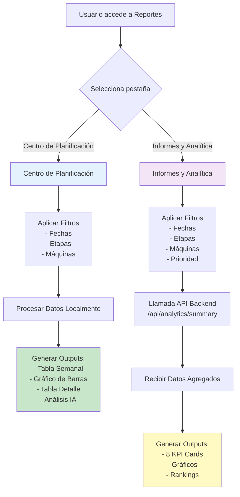

---

## 🗓️ Centro de Planificación

### Flujo de Procesamiento de Datos

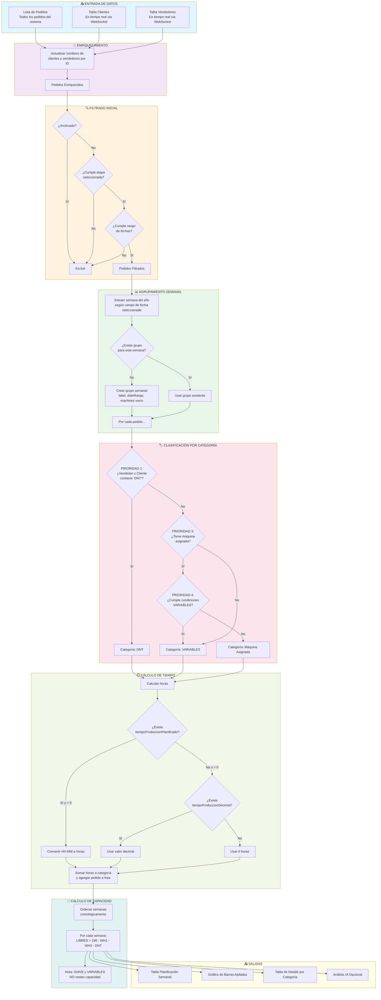

---

### 🏷️ Lógica de Clasificación de Pedidos

#### Orden de Prioridad (Estricto)

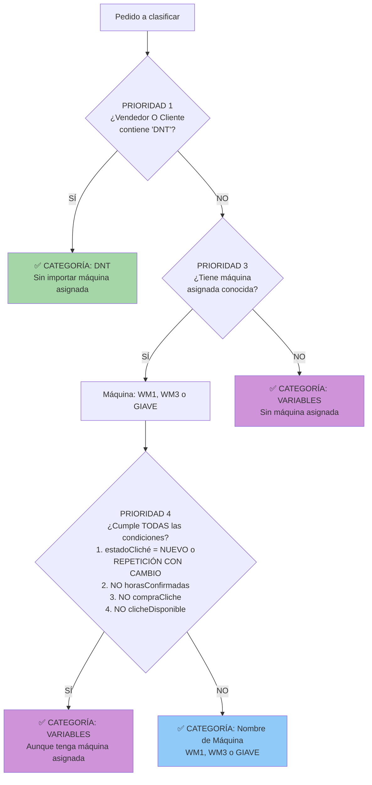

**Ejemplos Prácticos:**

| Caso | Vendedor | Cliente | Máquina | Estado Cliché | Horas Conf. | Compra Cl. | Cl. Disp. | ➡️ Categoría | Razonamiento |
|------|----------|---------|---------|---------------|-------------|------------|-----------|--------------|--------------|
| 1 | Juan DNT | Coca Cola | WM1 | REPETICIÓN | ❌ | ❌ | ❌ | **DNT** | Vendedor contiene "DNT" - Prioridad 1 |
| 2 | Pedro | Cliente DNT | WM3 | NUEVO | ❌ | ❌ | ❌ | **DNT** | Cliente contiene "DNT" - Prioridad 1 |
| 3 | María | Pepsi | WM1 | NUEVO | ❌ | ❌ | ❌ | **VARIABLES** | Tiene máquina pero cumple condiciones P4 |
| 4 | Carlos | Bimbo | WM3 | REPETICIÓN | ✅ | ✅ | ✅ | **Windmöller 3** | Tiene máquina y NO cumple P4 |
| 5 | Ana | Nestlé | - | NUEVO | ❌ | ❌ | ❌ | **VARIABLES** | Sin máquina asignada |
| 6 | Luis | Danone | GIAVE | REPETICIÓN | ✅ | ✅ | ✅ | **GIAVE** | Tiene máquina GIAVE y NO cumple P4 |

---

### 📊 Cálculo Detallado por Categoría

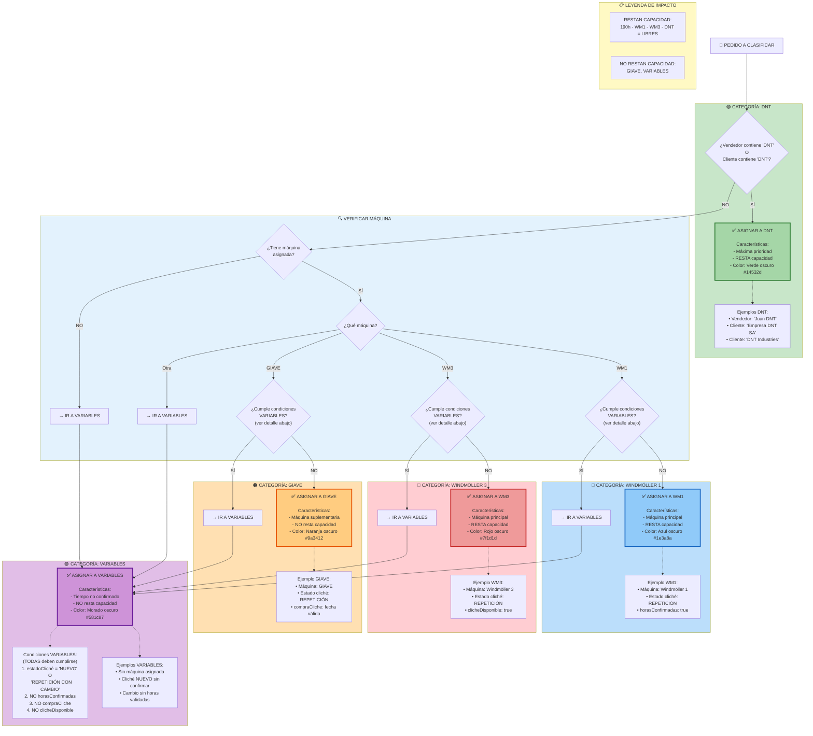

---

### 🔍 Condiciones Detalladas para VARIABLES

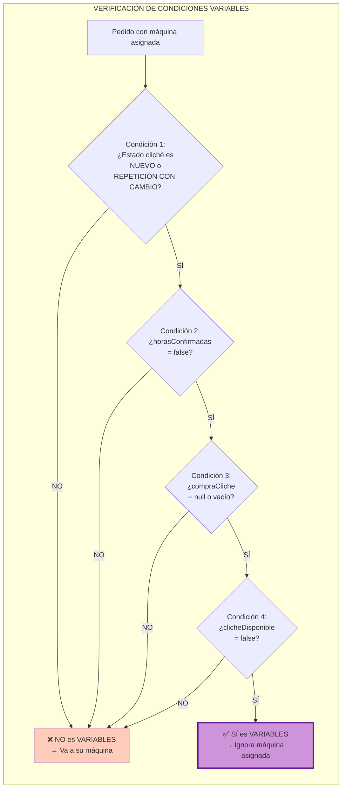

**Tabla de Decisión:**

| Estado Cliché | horasConfirmadas | compraCliche | clicheDisponible | Resultado |
|---------------|------------------|--------------|------------------|-----------|
| NUEVO | ❌ false | ❌ null | ❌ false | ✅ **VARIABLES** |
| REPETICIÓN CON CAMBIO | ❌ false | ❌ null | ❌ false | ✅ **VARIABLES** |
| NUEVO | ✅ true | ❌ null | ❌ false | ❌ **Máquina Asignada** |
| NUEVO | ❌ false | ✅ fecha | ❌ false | ❌ **Máquina Asignada** |
| NUEVO | ❌ false | ❌ null | ✅ true | ❌ **Máquina Asignada** |
| REPETICIÓN | ❌ false | ❌ null | ❌ false | ❌ **Máquina Asignada** |

---

### 📊 Resumen Visual de Categorías

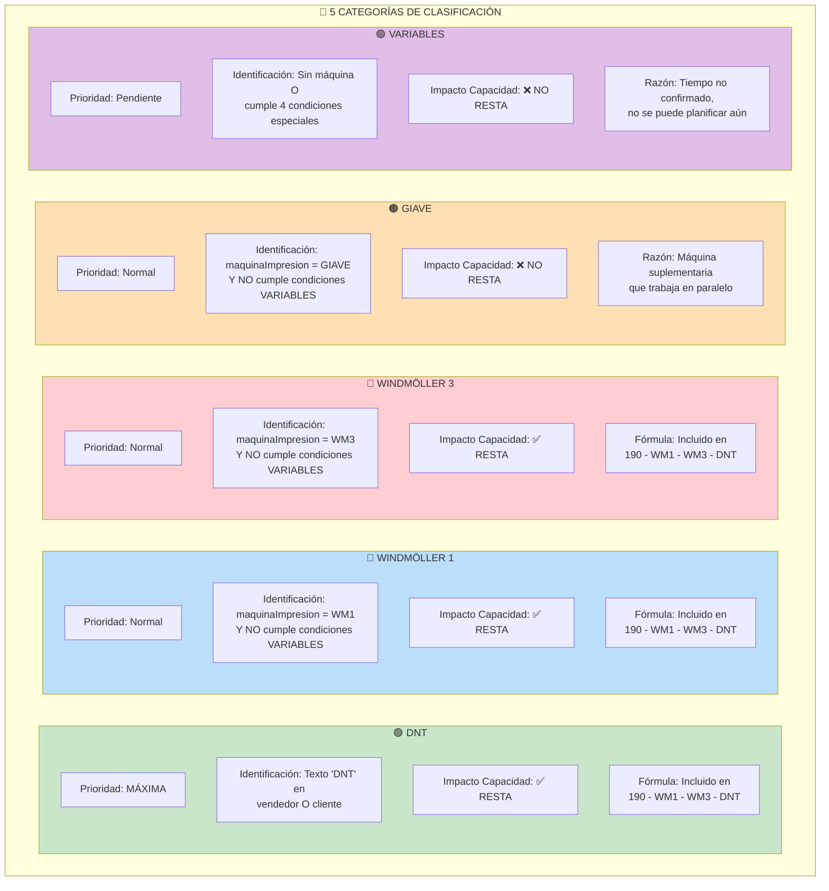

---

### ⏱️ Cálculo de Tiempo de Producción

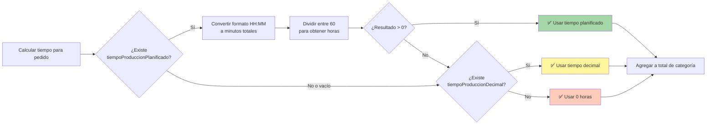

**Ejemplo de Cálculo:**

```javascript
// EJEMPLO 1: Usar tiempo planificado
pedido.tiempoProduccionPlanificado = "12:30"
→ parseTimeToMinutes("12:30") = 750 minutos
→ 750 / 60 = 12.5 horas
✅ RESULTADO: 12.5 horas

// EJEMPLO 2: Fallback a decimal
pedido.tiempoProduccionPlanificado = "00:00"
pedido.tiempoProduccionDecimal = 8.75
→ Planificado es 0, usar decimal
✅ RESULTADO: 8.75 horas

// EJEMPLO 3: Sin datos
pedido.tiempoProduccionPlanificado = null
pedido.tiempoProduccionDecimal = null
✅ RESULTADO: 0 horas
```

---

### 📐 Fórmula de Capacidad Libre

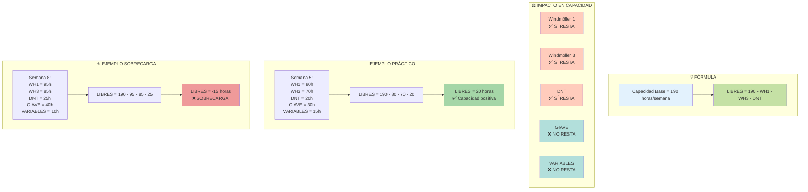

**Razonamiento:**
- **Capacidad Base**: 190 horas/semana representa la capacidad total disponible para producción
- **WH1 y WH3**: Máquinas principales de producción - ocupan capacidad física
- **DNT**: Pedidos prioritarios que DEBEN ejecutarse - reservan capacidad
- **GIAVE**: Máquina auxiliar/suplementaria - corre en paralelo, no afecta capacidad principal
- **VARIABLES**: Pedidos sin tiempo confirmado - no se pueden planificar aún

---

### 📊 Tabla de Planificación Semanal

**Estructura de Columnas:**

| Columna | Cálculo | Propósito |
|---------|---------|-----------|
| **Semana** | Número de semana del año (1-52) | Identificación única |
| **Fechas** | Lunes a Viernes (ej: "3 feb al 7 feb") | Visualización del rango |
| **WH-1** | Suma de horas de pedidos en categoría "Windmöller 1" | Carga de máquina principal 1 |
| **VARIABLES** | Suma de horas de pedidos pendientes de confirmar | Trabajo pendiente de planificar |
| **WH-3** | Suma de horas de pedidos en categoría "Windmöller 3" | Carga de máquina principal 2 |
| **SUP GIAVE** | Suma de horas de pedidos en categoría "GIAVE" | Carga de máquina suplementaria |
| **DNT** | Suma de horas de pedidos prioritarios DNT | Carga prioritaria |
| **LIBRES** | 190 - WH1 - WH3 - DNT | Capacidad disponible |

**Códigos de Color:**

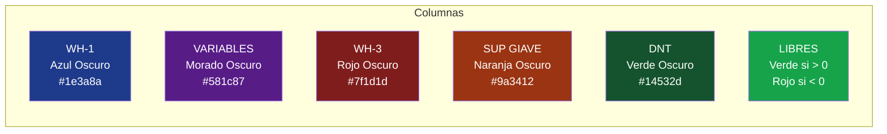

---

### 📊 Gráfico de Barras Apiladas

```mermaid
flowchart TB
    subgraph Structure["🏗️ ESTRUCTURA DEL GRÁFICO"]
        Weeks[Eje X: Semanas] --> Bars[Barras Apiladas]
        Hours[Eje Y: Horas 0-Max] --> Bars
        Bars --> Sections[Secciones por Categoría:<br/>WH1, VARIABLES, WH3, GIAVE, DNT]
    end
    
    subgraph Scaling["📏 ESCALADO"]
        FindMax[Encontrar valor máximo<br/>en todos los datos]
        FindMax --> SetHeight[Altura del gráfico = 500px fijos]
        SetHeight --> Calculate[Cada hora = 500px / valorMaximo]
        Calculate --> Heights[Altura de cada sección =<br/>horas × factor de escala]
    end
    
    subgraph Interaction["🖱️ INTERACCIÓN"]
        Click[Usuario hace clic en sección] --> Filter[Filtrar pedidos de:<br/>- Semana específica<br/>- Categoría específica]
        Filter --> ShowTable[Mostrar tabla de detalle<br/>con pedidos individuales]
    end
    
    subgraph Labels["🏷️ ETIQUETAS"]
        TopLabels[Encima de cada sección:<br/>Tiempo en formato HH:MM]
        BottomLabels[Debajo del gráfico:<br/>Semana y rango de fechas]
    end
    
    style Structure fill:#e1f5fe
    style Scaling fill:#f3e5f5
    style Interaction fill:#fff3e0
    style Labels fill:#e8f5e9
```

**Ejemplo Visual (ASCII):**

```
Horas
190│
   │  ╔═══╗      
170│  ║DNT║         ╔═══╗
   │  ║ 20║         ║DNT║
150│  ╠═══╣         ║ 15║
   │  ║GIA║         ╠═══╣
130│  ║ 30║         ║GIA║
   │  ╠═══╣         ║ 25║
110│  ║WH3║   ╔═══╗ ╠═══╣
   │  ║ 70║   ║VAR║ ║WH3║
 90│  ╠═══╣   ║ 40║ ║ 65║
   │  ║VAR║   ╠═══╣ ╠═══╣
 70│  ║ 15║   ║WH1║ ║VAR║
   │  ╠═══╣   ║ 50║ ║ 35║
 50│  ║WH1║   ╚═══╝ ╠═══╣
   │  ║ 80║         ║WH1║
 30│  ╚═══╝         ║ 75║
   │                ╚═══╝
 10│  
   └──────────────────────→ Semanas
     Sem 5      Sem 6     Sem 7
   (3-7 feb) (10-14 feb)(17-21 feb)
```

---

### 📋 Tabla de Detalle por Categoría

**Activación:**
- Usuario hace clic en una sección del gráfico de barras
- Se activa filtro: `{semana: "SEMANA X", categoria: "Y"}`

**Columnas y Ordenamiento:**

| Columna | Fuente de Datos | Ordenable | Tipo de Ordenamiento |
|---------|----------------|-----------|---------------------|
| ☑️ (Checkbox) | - | ❌ No | - |
| **Pedido** | `numeroPedidoCliente` | ✅ Sí | Alfabético |
| **Cliente** | `cliente` (actualizado en tiempo real) | ✅ Sí | Alfabético |
| **Descripción** | `producto` o `descripcion` | ✅ Sí | Alfabético |
| **Fecha Entrega** | `nuevaFechaEntrega` o `fechaEntrega` | ✅ Sí | Cronológico |
| **Metros** | `metros` | ✅ Sí | Numérico |
| **Tiempo (hh:mm)** | Calculado (ver sección anterior) | ✅ Sí | Numérico (comparando horas) |
| **Acción** | - | ❌ No | - |

**Formato de Fecha:**
```
Origen BD: "2026-02-15"
Formato mostrado: "15-02-2026"
```

**Indicadores Visuales:**
- 🔵 Fila hover: fondo gris claro
- 🔵 Fila seleccionada: fondo azul claro
- ➡️ Al hacer hover: aparece "Ver →" en columna Acción

---

## 📊 Informes y Analítica

### Flujo de Datos Backend

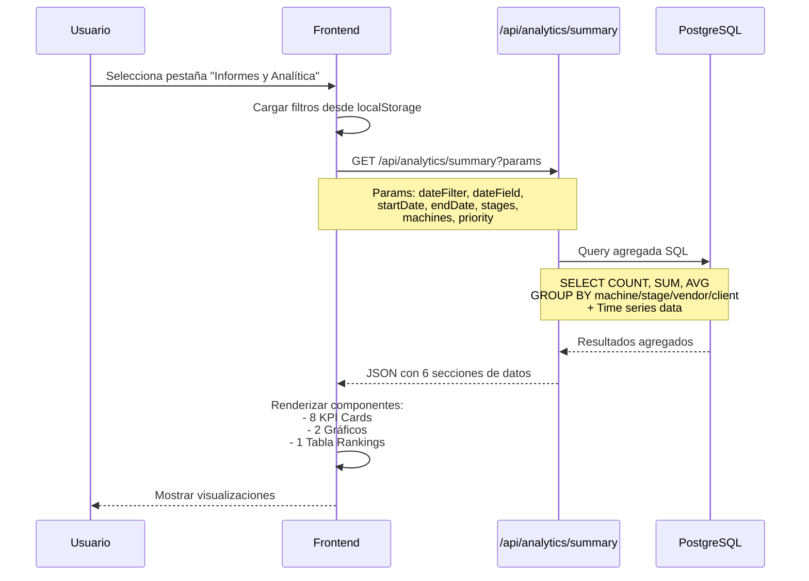

---

### 📈 KPI Cards (8 Tarjetas)

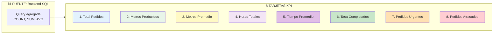

#### Detalle de Cada KPI:

##### 1️⃣ Total Pedidos
```sql
-- Cálculo en Backend
SELECT COUNT(*) as total_pedidos
FROM pedidos
WHERE [filtros aplicados]
```
**Explicación Simple:**  
Cuenta cuántos pedidos cumplen con los filtros seleccionados (fechas, etapas, máquinas, etc.)

**Subtitle:** `X completados` (del total)

---

##### 2️⃣ Metros Producidos
```sql
-- Cálculo en Backend
SELECT SUM(metros) as metros_totales
FROM pedidos
WHERE [filtros aplicados]
```
**Explicación Simple:**  
Suma todos los metros del campo `metros` de los pedidos filtrados.

**Formato:** Número con separador de miles (ej: 125,450)

---

##### 3️⃣ Metros Promedio
```sql
-- Cálculo en Backend
SELECT AVG(metros) as metros_promedio
FROM pedidos
WHERE [filtros aplicados]
```
**Fórmula Equivalente:**  
```
Metros Promedio = Metros Totales ÷ Total Pedidos
```

**Explicación Simple:**  
Cuántos metros produce cada pedido en promedio.

**Ejemplo:**
```
Total: 100 pedidos
Metros Totales: 50,000 m
→ Metros Promedio = 50,000 / 100 = 500 m por pedido
```

---

##### 4️⃣ Horas Totales
```sql
-- Cálculo en Backend
SELECT SUM(
    COALESCE(
        tiempo_produccion_decimal,
        -- Convertir HH:MM a decimal si no hay decimal
        EXTRACT(HOUR FROM tiempo_produccion_planificado::time) + 
        EXTRACT(MINUTE FROM tiempo_produccion_planificado::time) / 60.0
    )
) as tiempo_total_horas
FROM pedidos
WHERE [filtros aplicados]
```

**Explicación Simple:**  
1. Intenta sumar `tiempoProduccionDecimal`
2. Si no existe, convierte `tiempoProduccionPlanificado` (formato HH:MM) a horas decimales
3. Suma todo

**Formato:** HH:MM (ej: 245:30 = 245 horas y 30 minutos)

---

##### 5️⃣ Tiempo Promedio
```sql
-- Cálculo en Backend
SELECT AVG(tiempo_total_horas) as tiempo_promedio_horas
```

**Fórmula Equivalente:**
```
Tiempo Promedio = Horas Totales ÷ Total Pedidos
```

**Explicación Simple:**  
Cuánto tiempo de producción requiere cada pedido en promedio.

**Formato:** HH:MM

---

##### 6️⃣ Tasa Completados
```sql
-- Cálculo en Backend
SELECT 
    COUNT(*) FILTER (WHERE etapa_actual = 'COMPLETADO') as completados,
    COUNT(*) as total
FROM pedidos
WHERE [filtros aplicados]
```

**Fórmula Frontend:**
```javascript
porcentaje = (pedidos_completados / total_pedidos) × 100
```

**Explicación Simple:**  
Qué porcentaje de pedidos ya están terminados.

**Ejemplo:**
```
Total: 150 pedidos
Completados: 120 pedidos
→ Tasa = (120 / 150) × 100 = 80%
```

**Subtitle:** `120/150` (fracción)

---

##### 7️⃣ Pedidos Urgentes
```sql
-- Cálculo en Backend
SELECT COUNT(*) as pedidos_urgentes
FROM pedidos
WHERE prioridad IN ('URGENTE', 'ALTA')
AND [otros filtros]
```

**Explicación Simple:**  
Cuenta pedidos marcados como `prioridad = 'URGENTE'` o `prioridad = 'ALTA'`.

---

##### 8️⃣ Pedidos Atrasados
```sql
-- Cálculo en Backend
SELECT COUNT(*) as pedidos_atrasados
FROM pedidos
WHERE (nueva_fecha_entrega < CURRENT_DATE OR fecha_entrega < CURRENT_DATE)
AND etapa_actual NOT IN ('COMPLETADO', 'ARCHIVADO')
AND [otros filtros]
```

**Explicación Simple:**  
Cuenta pedidos cuya fecha de entrega ya pasó pero aún NO están completados ni archivados.

**Condiciones:**
1. Fecha de entrega < Hoy
2. Y etapa ≠ COMPLETADO
3. Y etapa ≠ ARCHIVADO

---

### 📊 Gráfico: Tendencias de Producción

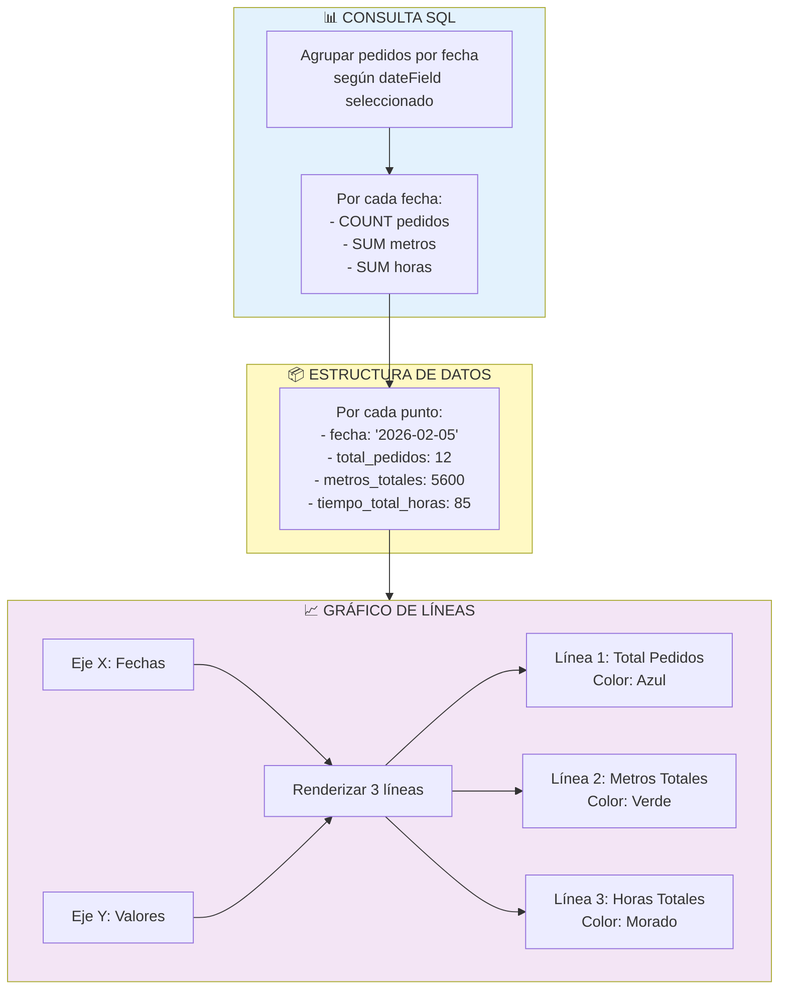

**Ejemplo de Serie Temporal:**

| Fecha | Total Pedidos | Metros | Horas |
|-------|--------------|--------|-------|
| 2026-02-01 | 8 | 3,200 | 58.5 |
| 2026-02-02 | 12 | 5,600 | 85.0 |
| 2026-02-03 | 6 | 2,100 | 42.3 |
| 2026-02-04 | 15 | 7,200 | 102.8 |
| 2026-02-05 | 10 | 4,500 | 73.2 |

---

### 🖨️ Gráfico: Rendimiento por Máquina

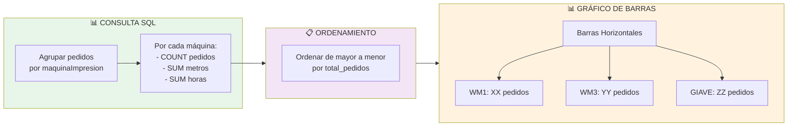

**Estructura de Datos:**

```typescript
[
  {
    maquina_impresion: "Windmöller 1",
    total_pedidos: 45,
    metros_totales: 22500,
    tiempo_total_horas: 320.5
  },
  {
    maquina_impresion: "Windmöller 3",
    total_pedidos: 38,
    metros_totales: 19000,
    tiempo_total_horas: 280.8
  },
  {
    maquina_impresion: "GIAVE",
    total_pedidos: 22,
    metros_totales: 8800,
    tiempo_total_horas: 145.2
  }
]
```

---

### 🏆 Tabla de Rankings

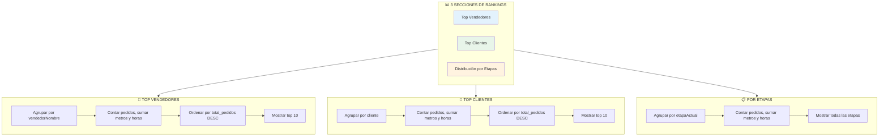

**Columnas en cada ranking:**

| Columna | Vendedores | Clientes | Etapas |
|---------|-----------|----------|--------|
| **Nombre** | Nombre del vendedor | Nombre del cliente | Nombre de la etapa |
| **Pedidos** | Total pedidos | Total pedidos | Total pedidos |
| **Metros** | Metros totales | Metros totales | Metros totales |
| **Horas** | Horas totales (HH:MM) | Horas totales (HH:MM) | Horas totales (HH:MM) |
| **% del Total** | % respecto a total filtrado | % respecto a total filtrado | % respecto a total filtrado |

**Ejemplo de Cálculo de Porcentaje:**

```javascript
// Backend calcula totales globales primero
total_global_pedidos = 200

// Por cada vendedor
vendedor_pedidos = 45
porcentaje = (45 / 200) × 100 = 22.5%
```

---

## 🔍 Filtros y Configuración

### Persistencia en LocalStorage

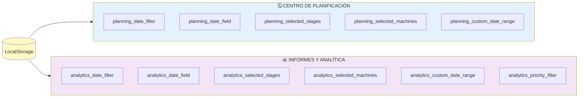

**Nota:** Cada pestaña tiene sus propios filtros independientes que se guardan y cargan automáticamente.

---

### Filtro de Fechas

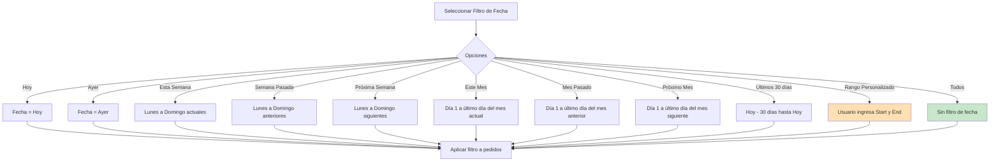

**Campo de Fecha:**
- Usuario puede elegir qué campo usar: `nuevaFechaEntrega`, `fechaEntrega`, `fechaCreacion`
- Este campo se usa para comparar contra el rango seleccionado

---

### Filtros Avanzados (Solo Analítica)

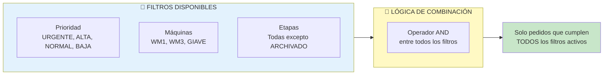

---

## 📖 Glosario de Términos

### Términos Técnicos

| Término | Definición | Ejemplo |
|---------|-----------|---------|
| **Enriquecimiento** | Proceso de actualizar datos de pedidos con información actualizada de otras tablas (clientes, vendedores) | Pedido tiene `clienteId="abc123"`, se busca el nombre actual en tabla clientes |
| **Agregación** | Combinar múltiples valores en uno solo (suma, promedio, conteo) | SUM(metros) agrupa todos los metros en un solo total |
| **Serie Temporal** | Datos organizados por fecha/tiempo | Lista de pedidos por día: 2026-02-01: 12, 2026-02-02: 15 |
| **KPI** | Key Performance Indicator - Métrica clave de rendimiento | "Total Pedidos", "Tasa Completados" |
| **Tooltip** | Texto explicativo que aparece al pasar el mouse | ℹ️ icono muestra información adicional |

---

### Términos de Negocio

| Término | Definición | Importancia |
|---------|-----------|-------------|
| **DNT** | Categoría de pedidos prioritarios (cliente o vendedor contiene "DNT") | Máxima prioridad - SIEMPRE va a esta categoría |
| **VARIABLES** | Pedidos con clichés nuevos o cambios sin confirmar | No se pueden planificar aún - tiempo incierto |
| **Capacidad Libre** | Horas disponibles después de asignar trabajo a máquinas principales | Indicador crítico de sobrecarga |
| **Tiempo Planificado** | Estimación en formato HH:MM de duración de producción | Usado para planificación semanal |
| **Tiempo Decimal** | Horas en formato decimal (ej: 8.5 horas = 8h 30min) | Alternativa al formato HH:MM |

---

### Estados de Cliché

| Estado | Significado | Impacto en Clasificación |
|--------|------------|-------------------------|
| **NUEVO** | Cliché debe crearse desde cero | Puede llevar a categoría VARIABLES |
| **REPETICIÓN** | Usar cliché existente sin cambios | NO afecta clasificación |
| **REPETICIÓN CON CAMBIO** | Modificar cliché existente | Puede llevar a categoría VARIABLES |

**Condiciones para VARIABLES:**
```
Si (estado = NUEVO O REPETICIÓN CON CAMBIO)
Y NO horasConfirmadas
Y NO compraCliche
Y NO clicheDisponible
→ Categoría VARIABLES
```

---

## 🔄 Sincronización en Tiempo Real

### WebSocket Events

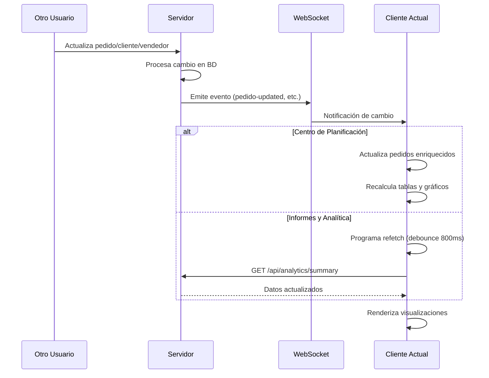

**Events Monitoreados:**
- `pedido-created`
- `pedido-updated`
- `pedido-deleted`
- `pedidos-by-vendedor-updated`
- `pedidos-by-cliente-updated`
- `vendedor-updated` (legacy)
- `vendedor-deleted` (legacy)

---

## 💾 Exportación de Datos

### Formatos Disponibles (Solo Analítica)

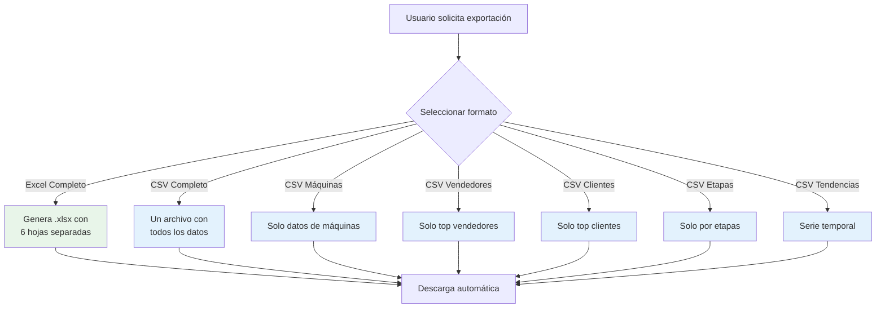

**Estructura Excel:**

| Hoja | Contenido |
|------|-----------|
| **Resumen** | Los 8 KPIs principales |
| **Por Máquina** | Métricas agrupadas por máquina |
| **Por Etapa** | Métricas agrupadas por etapa |
| **Top Vendedores** | Ranking de vendedores (top 10) |
| **Top Clientes** | Ranking de clientes (top 10) |
| **Tendencias** | Serie temporal día a día |

---

## 🎯 Casos de Uso Prácticos

### Caso 1: Detectar Sobrecarga Semanal

**Objetivo:** Identificar semanas con capacidad negativa

**Pasos:**
1. Ir a "Centro de Planificación"
2. Seleccionar filtro de fecha: "Próximo Mes"
3. Revisar columna "LIBRES" en Tabla Semanal
4. ✅ Verde = Capacidad positiva
5. ❌ Rojo = SOBRECARGA

**Interpretación:**
```
Semana 10: LIBRES = -15 horas
→ WM1 + WM3 + DNT exceden 190 horas
→ Acción: Redistribuir pedidos o ajustar fechas
```

---

### Caso 2: Analizar Rendimiento de Vendedor

**Objetivo:** Ver cuántos pedidos y metros genera un vendedor

**Pasos:**
1. Ir a "Informes y Analítica"
2. Seleccionar filtro de fecha: "Este Mes"
3. Scrollear a "Top Vendedores"
4. Buscar nombre del vendedor
5. Ver métricas:
   - Total pedidos
   - Metros producidos
   - Horas consumidas
   - % del total

---

### Caso 3: Revisar Pedidos de una Categoría

**Objetivo:** Ver lista detallada de pedidos DNT de una semana

**Pasos:**
1. Ir a "Centro de Planificación"
2. En gráfico de barras, hacer clic en sección "DNT" de Semana X
3. Se abre tabla de detalle automáticamente
4. Ver todos los pedidos DNT:
   - Número de pedido
   - Cliente
   - Fecha de entrega
   - Metros
   - Tiempo estimado
5. Hacer clic en fila para ver detalles completos

---

### Caso 4: Identificar Pedidos Atrasados

**Objetivo:** Encontrar pedidos que debieron entregarse pero siguen en proceso

**Pasos:**
1. Ir a "Informes y Analítica"
2. Observar KPI "Pedidos Atrasados"
3. Número en rojo indica cantidad
4. Para ver cuáles son:
   - Ir a vista principal de pedidos
   - Filtrar por fecha de entrega < Hoy
   - Excluir etapas: COMPLETADO, ARCHIVADO

---

## 🔧 Modificación y Mejora

### Para Cambiar la Capacidad Base

**Archivo:** `components/ReportView.tsx`

**Línea 78:**
```javascript
const CAPACITY_BASE = 190; // ← CAMBIAR ESTE NÚMERO
```

**Impacto:**
- Afecta cálculo de "LIBRES"
- Nueva fórmula: `LIBRES = [NUEVO_VALOR] - WH1 - WH3 - DNT`

---

### Para Agregar una Nueva Categoría

**Pasos:**

1. **Agregar constante:**
```javascript
const MACHINE_NUEVA = 'NUEVA_CATEGORIA';
```

2. **Agregar a opciones:**
```javascript
const allMachineOptions = [
  'Windmöller 1', 
  'Windmöller 3', 
  'GIAVE', 
  'DNT', 
  'VARIABLES',
  'NUEVA_CATEGORIA' // ← Agregar aquí
];
```

3. **Definir lógica de clasificación** (líneas 420-480):
```javascript
// Agregar nueva condición
else if (/* condición para nueva categoría */) {
    machineCategory = MACHINE_NUEVA;
}
```

4. **Agregar color** en `PlanningTable.tsx` y `PlanningChart.tsx`:
```javascript
const MACHINE_COLORS: Record<string, string> = {
  // ... existentes ...
  'NUEVA_CATEGORIA': 'bg-teal-900 text-white border-teal-950'
};
```

5. **Decidir si resta capacidad:**
```javascript
// Si NO debe restar capacidad, NO agregar a fórmula
// Si SÍ debe restar, agregar a:
group.freeCapacity = CAPACITY_BASE - wh1 - wh3 - dnt - nueva;
```

---

### Para Cambiar KPIs en Analítica

**Archivo:** `components/analytics/KPICards.tsx`

**Modificar array `cards`** (líneas 41-138):

```typescript
const cards: KPICardData[] = [
  {
    title: 'Nombre del KPI',
    value: summary.campo_del_backend, // ← Fuente de datos
    subtitle: 'descripción',
    tooltip: 'Cómo se calcula este KPI',
    icon: (/* SVG icon */),
    colorClass: 'from-color-500 to-color-600'
  },
  // ... más KPIs
];
```

**Backend correspondiente:**  
Modificar `backend/routes/analytics.js` para incluir nuevos cálculos SQL.

---

## ❓ Preguntas Frecuentes

### ¿Por qué GIAVE no resta capacidad?

**R:** GIAVE es una máquina suplementaria que trabaja en paralelo. No compite por el mismo tiempo productivo que WM1 y WM3, por lo que no reduce la capacidad disponible de las máquinas principales.

---

### ¿Qué pasa si un pedido tiene máquina asignada pero cumple condiciones VARIABLES?

**R:** La lógica de PRIORIDAD 4 tiene precedencia. Aunque tenga máquina asignada, si cumple TODAS las condiciones de VARIABLES (cliché nuevo/cambiado + sin confirmar horas/compra/disponibilidad), va a VARIABLES.

**Ejemplo:**
```
Pedido #123
- Máquina: WM1
- Estado cliché: NUEVO
- horasConfirmadas: false
- compraCliche: null
- clicheDisponible: false
→ Categoría: VARIABLES (NO WM1)
```

---

### ¿Cómo se calcula el número de semana?

**R:** Usa estándar ISO 8601:
- Semana empieza en Lunes
- Semana 1 = primera semana con al menos 4 días del año nuevo
- Semana 52 o 53 = última del año

**Función:** `getWeekNumber()` en `utils/weekUtils.ts`

---

### ¿Los filtros de Planning y Analytics son independientes?

**R:** SÍ. Cada pestaña guarda sus propios filtros en localStorage con prefijos diferentes (`planning_*` vs `analytics_*`). Esto permite tener configuraciones diferentes según el uso.

---

### ¿Qué pasa si cambio el campo de fecha?

**R:** El sistema re-agrupa automáticamente todos los pedidos usando el nuevo campo. Por ejemplo:
- Campo anterior: `fechaEntrega`
- Campo nuevo: `nuevaFechaEntrega`
→ Las semanas pueden cambiar completamente si las fechas son diferentes

---

## 📚 Referencias de Código

### Archivos Principales

| Archivo | Responsabilidad |
|---------|----------------|
| `components/ReportView.tsx` | Componente principal - Pestañas y lógica de planificación |
| `components/AnalyticsDashboard.tsx` | Dashboard de analítica - Filtros y layout |
| `components/PlanningTable.tsx` | Tabla semanal de planificación |
| `components/PlanningChart.tsx` | Gráfico de barras apiladas |
| `components/analytics/KPICards.tsx` | 8 tarjetas de KPIs |
| `hooks/useAnalyticsData.ts` | Hook para fetch de datos de analítica |
| `utils/weekUtils.ts` | Funciones de cálculo de semanas |
| `utils/date.ts` | Funciones de formato de fechas y tiempo |
| `backend/routes/analytics.js` | API endpoint de analítica (backend) |

---

## 🎓 Conclusión

Este documento proporciona una visión completa y detallada de cómo funcionan los reportes del sistema. Está diseñado para ser comprensible tanto para personas técnicas (desarrolladores) como no técnicas (gerentes, analistas de negocio).

**Para desarrolladores:**  
Utiliza este documento como referencia antes de modificar lógica de cálculos.

**Para gerencia:**  
Utiliza los diagramas y explicaciones para entender qué significan los números y tomar decisiones informadas.

**Mantenimiento:**  
Actualizar este documento cada vez que se modifique la lógica de cálculo de métricas.

---

**📅 Fecha de Creación:** 6 de Febrero de 2026  
**✍️ Versión:** 1.0  
**🔄 Última Actualización:** 6 de Febrero de 2026
