# 🚀 Aplicación Web en Tiempo Real con Dokploy

## ¿Es posible? ¡ABSOLUTAMENTE SÍ! ✅

Dokploy puede soportar completamente una aplicación web moderna en tiempo real sin necesidad de Firestore. Aquí tienes la hoja de ruta completa:

## 🔄 Características en Tiempo Real que Implementaremos

### 1. **Actualizaciones en Tiempo Real**
- **WebSockets** para sincronización instantánea
- **Server-Sent Events (SSE)** como fallback
- **Polling inteligente** si es necesario

### 2. **Persistencia Robusta**
- ✅ **SQLite** ya implementado
- 🔄 **Backup automático** 
- 🔄 **Replicación de datos**
- 🔄 **Recuperación ante fallos**

### 3. **Escalabilidad**
- **Redis** para caché y sesiones
- **PostgreSQL** para mayor escala (opcional)
- **Load balancing** nativo de Dokploy

### 4. **Monitoreo y Observabilidad**
- **Logs estructurados**
- **Métricas de performance**
- **Health checks avanzados**

### 5. **Seguridad**
- **Autenticación JWT**
- **Rate limiting**
- **HTTPS automático**

## 🛠️ Plan de Implementación

### Fase 1: WebSockets (INMEDIATO) 🔥
```javascript
// Backend: Socket.IO
npm install socket.io

// Frontend: Cliente WebSocket
npm install socket.io-client
```

### Fase 2: Cache y Performance
```javascript
// Redis para cache
npm install redis ioredis

// Compresión y optimización
npm install compression helmet
```

### Fase 3: Monitoreo
```javascript
// Winston para logs
npm install winston

// Prometheus métricas
npm install prom-client
```

## 📊 Arquitectura Objetivo

```mermaid
graph TB
    A[Frontend React] -->|WebSocket| B[Socket.IO Server]
    A -->|HTTP/REST| C[Express API]
    
    B --> D[Redis Cache]
    C --> E[SQLite/PostgreSQL]
    
    F[Dokploy] --> G[Load Balancer]
    G --> H[App Instance 1]
    G --> I[App Instance 2]
    
    J[Backup Service] --> E
    K[Monitoring] --> H
    K --> I
    
    style A fill:#61dafb
    style B fill:#25c2a0
    style C fill:#339933
    style D fill:#dc382d
    style E fill:#003b57
    style F fill:#7c3aed
```



## 🎯 Beneficios vs. Firestore

| Característica | Con Dokploy | Con Firestore |
|---------------|-------------|---------------|
| **Costo** | 💰 Muy bajo | 💰💰💰 Escalable |
| **Control** | 🎛️ Total | 🎛️ Limitado |
| **Latencia** | ⚡ Mínima | ⚡ Variable |
| **Customización** | 🔧 Ilimitada | 🔧 Restringida |
| **Vendor Lock-in** | ❌ No | ✅ Sí |
| **Offline Support** | 🔄 Configurable | 🔄 Nativo |

## 🚀 Ventajas Específicas de Dokploy

### ✅ **Infraestructura**
- Docker nativo
- SSL automático
- Backup integrado
- Escalado horizontal

### ✅ **Desarrollo**
- Git deployment
- Rollbacks instant
- Variables de entorno
- Logs centralizados

### ✅ **Costo**
- Sin límites de lectura/escritura
- Sin sorpresas en facturación
- Recursos dedicados

## 🎪 Casos de Uso Reales que Dokploy Maneja

### 📊 **Dashboards en Tiempo Real**
- Grafana + InfluxDB
- Custom analytics
- IoT monitoring

### 💬 **Aplicaciones de Chat**
- Socket.IO
- Redis pub/sub
- Escalado multi-instancia

### 🎮 **Aplicaciones Colaborativas**
- Google Docs-like
- Real-time editing
- Conflict resolution

### 📈 **Trading Platforms**
- Price feeds en vivo
- Order books
- Sub-second latency

## 🛡️ Robustez y Confiabilidad

### **Tolerancia a Fallos**
```yaml
# docker-compose.yml
services:
  app:
    restart: always
    healthcheck:
      test: ["CMD", "curl", "-f", "http://localhost:8080/health"]
      interval: 30s
      timeout: 10s
      retries: 3
```

### **Backup Automático**
```bash
# Cron job diario
0 2 * * * docker run --rm -v pedidos_data:/data alpine tar czf /backup/daily_$(date +%Y%m%d).tar.gz -C /data .
```

### **Monitoring**
```javascript
// Health checks avanzados
app.get('/health/detailed', (req, res) => {
  res.json({
    status: 'healthy',
    database: sqliteEnabled,
    websockets: io.engine.clientsCount,
    memory: process.memoryUsage(),
    uptime: process.uptime()
  });
});
```

## 🎯 Conclusión

**Dokploy NO SOLO puede**, sino que es **SUPERIOR** para muchos casos de uso porque te da:

1. **📊 Control Total** - Eres dueño de tus datos y lógica
2. **💰 Costos Predecibles** - Sin sorpresas de facturación
3. **⚡ Performance** - Latencia mínima, hardware dedicado
4. **🔧 Flexibilidad** - Puedes implementar cualquier tecnología
5. **🛡️ Seguridad** - Control total sobre seguridad y compliance

## ➡️ Siguiente Paso

¿Quieres que implemente las WebSockets ahora mismo para actualizaciones en tiempo real? Con Socket.IO puedes tener:

- **Cambios instantáneos** cuando alguien mueve un pedido
- **Notificaciones en vivo** de nuevos pedidos
- **Indicadores de presencia** (quién está conectado)
- **Colaboración simultánea** sin conflictos

Solo dime: **"¡Implementemos WebSockets!"** y en 15 minutos tendrás tiempo real funcionando. 🚀
