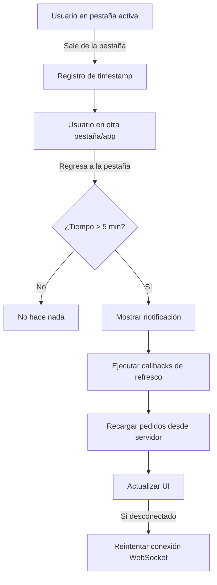

# 🔄 Mejora del Sistema de Gestión de Inactividad del Usuario

## 📋 Resumen

Se ha implementado un sistema mejorado de detección de inactividad que **actualiza automáticamente la aplicación** cuando el usuario regresa a la pestaña después de un período de inactividad.

---

## 🎯 Problema Resuelto

**Antes:**
- Cuando un usuario cambiaba de pestaña y el tiempo de inactividad superaba cierto umbral, el servidor desconectaba el WebSocket
- Al regresar a la pestaña, el usuario veía datos desactualizados
- Era necesario recargar manualmente la página (F5) para ver los cambios más recientes

**Ahora:**
- La aplicación detecta automáticamente cuando el usuario regresa
- Si estuvo inactivo más de 5 minutos, **actualiza automáticamente los datos**
- El usuario siempre ve la información más reciente sin necesidad de refrescar manualmente

---

## 🛠️ Implementación Técnica

### 1. **Servicio WebSocket (`services/websocket.ts`)**

#### Nuevas propiedades privadas:
```typescript
// Control de visibilidad de pestaña y sincronización
private isPageVisible = true;
private lastActivityTime = Date.now();
private inactivityTimeout: NodeJS.Timeout | null = null;
private pageRefreshCallbacks: (() => void)[] = [];
private readonly INACTIVITY_THRESHOLD = 5 * 60 * 1000; // 5 minutos
```

#### Método `setupVisibilityDetection()`:
- **Detecta cambios de visibilidad** usando `document.visibilitychange`
- **Eventos de respaldo:** `window.focus`, `window.blur`, `window.pageshow`
- **Calcula tiempo de inactividad** al regresar a la pestaña
- **Dispara actualización** si el tiempo supera el umbral (5 minutos)

```typescript
private setupVisibilityDetection() {
  const handleVisibilityChange = () => {
    if (document.hidden) {
      // Usuario salió
      this.isPageVisible = false;
      this.lastActivityTime = Date.now();
    } else {
      // Usuario regresó
      this.isPageVisible = true;
      const timeAway = Date.now() - this.lastActivityTime;
      
      if (timeAway > this.INACTIVITY_THRESHOLD) {
        this.handlePageReturn();
      }
    }
  };
  
  document.addEventListener('visibilitychange', handleVisibilityChange);
}
```

#### Método `handlePageReturn()`:
- **Notifica al usuario** que se están actualizando los datos
- **Ejecuta callbacks** registrados para refrescar componentes
- **Reintenta reconexión** si el WebSocket está desconectado

#### Método público `subscribeToPageReturn()`:
```typescript
public subscribeToPageReturn(callback: () => void): () => void {
  this.pageRefreshCallbacks.push(callback);
  return () => {
    // Función de limpieza para desuscribirse
    const index = this.pageRefreshCallbacks.indexOf(callback);
    if (index > -1) {
      this.pageRefreshCallbacks.splice(index, 1);
    }
  };
}
```

---

### 2. **Hook useWebSocket (`hooks/useWebSocket.ts`)**

#### Actualización de la interfaz:
```typescript
export interface UseWebSocketReturn {
  // ... propiedades existentes
  subscribeToPageReturn: (callback: () => void) => () => void; // ⬅️ NUEVO
}
```

#### Implementación:
```typescript
const subscribeToPageReturn = useCallback((callback: () => void) => {
  return webSocketService.subscribeToPageReturn(callback);
}, []);

return {
  // ... propiedades existentes
  subscribeToPageReturn // ⬅️ NUEVO
};
```

---

### 3. **Componente Principal App (`App.tsx`)**

#### Uso del nuevo hook:
```typescript
const { 
  // ... propiedades existentes
  subscribeToPageReturn // ⬅️ NUEVO
} = useWebSocket(currentUserId, currentUserRole);
```

#### Suscripción al evento de retorno:
```typescript
useEffect(() => {
  const unsubscribe = subscribeToPageReturn(async () => {
    console.log('🔄 Refrescando datos después de inactividad...');
    setIsLoading(true);
    
    try {
      const { store } = await import('./services/storage');
      const currentPedidos = await store.getAll();
      setPedidos(currentPedidos);
      console.log('✅ Datos actualizados exitosamente');
    } catch (error) {
      console.error('❌ Error al refrescar datos:', error);
    } finally {
      setIsLoading(false);
    }
  });

  return () => unsubscribe(); // Limpieza al desmontar
}, [subscribeToPageReturn, setPedidos, setIsLoading]);
```

---

## ⚙️ Configuración

### Umbral de Inactividad
```typescript
private readonly INACTIVITY_THRESHOLD = 5 * 60 * 1000; // 5 minutos
```

**Para cambiar el tiempo de inactividad:**
1. Editar `services/websocket.ts`
2. Modificar `INACTIVITY_THRESHOLD` (valor en milisegundos)
   - 1 minuto = `60 * 1000`
   - 3 minutos = `3 * 60 * 1000`
   - 10 minutos = `10 * 60 * 1000`

---

## 🔍 Flujo de Funcionamiento



---

## 📊 Eventos Detectados

| Evento | Descripción | Acción |
|--------|-------------|---------|
| `visibilitychange` | Cambio de visibilidad del documento | Principal detector |
| `window.focus` | Ventana recibe foco | Respaldo |
| `window.blur` | Ventana pierde foco | Respaldo |
| `pageshow` | Página cargada desde cache (back/forward) | Detector especial |

---

## 🎨 Experiencia de Usuario

### Al regresar después de inactividad:

1. **Notificación visual:**
   ```
   ℹ️ Actualizando datos
   Sincronizando información reciente...
   ```

2. **Indicador de carga:**
   - Aparece brevemente mientras se cargan los datos
   - Desaparece automáticamente al completar

3. **Sin interrupciones:**
   - No se pierde el contexto de navegación
   - No se cierran modales abiertos (aunque se recomienda cerrarlos si los datos cambiaron)

---

## 🔧 Solución de Problemas

### Problema: Los datos no se actualizan
**Verificar:**
1. Consola del navegador para errores
2. Conexión al servidor backend
3. El umbral de tiempo configurado

### Problema: Se actualiza demasiado seguido
**Solución:**
- Aumentar `INACTIVITY_THRESHOLD` en `websocket.ts`

### Problema: No se detecta el retorno del usuario
**Verificar:**
- Permisos del navegador
- Extensiones que puedan bloquear eventos
- Modo de navegación privada/incógnito

---

## 📝 Logs de Consola

```javascript
// Al salir de la pestaña
👁️ Usuario salió de la pestaña

// Al regresar (menos de 5 min)
👁️ Usuario regresó a la pestaña después de 120s

// Al regresar (más de 5 min)
👁️ Usuario regresó a la pestaña después de 360s
🔄 Inactividad detectada, actualizando datos...
🔄 Refrescando datos después de inactividad...
✅ Datos actualizados exitosamente
```

---

## ✅ Beneficios

1. **Experiencia mejorada:** El usuario siempre ve datos actuales
2. **Sin recarga manual:** No necesita presionar F5
3. **Eficiencia:** Solo actualiza cuando es necesario (después de inactividad)
4. **Reconexión automática:** Si el WebSocket se desconectó, intenta reconectar
5. **No invasivo:** Funciona en segundo plano sin interrumpir al usuario

---

## 🚀 Próximas Mejoras Sugeridas

1. **Sincronización selectiva:** Solo actualizar datos modificados en lugar de todo
2. **Indicador visual:** Mostrar badge con cantidad de cambios mientras está inactivo
3. **Configuración por usuario:** Permitir que cada usuario configure su umbral
4. **Modo offline robusto:** Guardar cambios locales y sincronizar al reconectar
5. **Notificación de cambios:** Alertar sobre pedidos que cambiaron durante la inactividad

---

## 📅 Fecha de Implementación
**Octubre 20, 2025**

## 👤 Autor
GitHub Copilot para JhonyAlex

---

## 🔗 Archivos Modificados

- ✅ `services/websocket.ts` - Lógica de detección y gestión de inactividad
- ✅ `hooks/useWebSocket.ts` - Exportación del nuevo callback
- ✅ `App.tsx` - Suscripción al evento de retorno de página
