# Solución de Almacenamiento Persistente ✅

## ¿Qué se ha implementado?

Se ha solucionado el problema de pérdida de datos al redesplegar en Dokploy implementando **almacenamiento persistente con SQLite**.

### Cambios realizados:

1. **📦 Nueva dependencia**: `sqlite3` para base de datos persistente
2. **🗄️ Cliente SQLite**: Clase `SQLiteClient` para manejar la base de datos
3. **🔄 Backend actualizado**: Lógica híbrida Firestore/SQLite/Memoria
4. **🐳 Dockerfile modificado**: Soporte para volúmenes persistentes
5. **📁 Estructura de datos**: Directorio `/app/backend/data` para persistencia

## ⚡ Cómo funciona

```mermaid
graph TD
    A[Inicio Backend] --> B{¿Google Cloud?}
    B -->|Sí| C[Firestore]
    B -->|No| D[SQLite]
    D --> E[Base de datos local persistente]
    C --> F[Base de datos cloud]
    
    style C fill:#4285f4
    style D fill:#003b57
    style E fill:#90EE90
    style F fill:#90EE90
```



### Modos de almacenamiento (por prioridad):
1. **🌐 Firestore** - Para Google Cloud (automático)
2. **💾 SQLite** - Para Dokploy y desarrollo (persistente)
3. **🧠 Memoria** - Solo como fallback (no persistente)

## 🚀 Configuración en Dokploy

### 1. Volumen Persistente (OBLIGATORIO)

En la configuración de tu aplicación en Dokploy:

**📁 Mapeo de Volumen:**
- **Fuente (Host):** `pedidos_data` (nombre del volumen)
- **Destino (Contenedor):** `/app/backend/data`
- **Tipo:** Volumen Docker

### 2. Despliegue

1. **Haz commit** de estos cambios
2. **Push** al repositorio
3. **Redespliega** en Dokploy
4. **Configura el volumen** como se indica arriba

### 3. Verificación

Después del despliegue, verifica que todo funciona:

```bash
# Check de estado
curl https://tu-dominio.com/health

# Respuesta esperada:
{
  "status": "healthy",
  "firestoreEnabled": false,
  "sqliteEnabled": true,
  "inMemoryFallback": false
}
```

## 📊 Logs de funcionamiento

### ✅ Logs correctos
```
Environment check: { isCloudEnvironment: undefined }
Initializing SQLite database...
SQLite database connected at /app/backend/data/pedidos.db
SQLite tables created/verified successfully
SQLite database initialized successfully
Servidor escuchando en el puerto 8080
Firestore habilitado: false
SQLite habilitado: true
Modo: Local/SQLite
```

### ❌ Logs de problema
```
Failed to initialize SQLite: [error]
SQLite will be disabled, using in-memory storage
Modo: Local/Memory  # ⚠️ ESTO INDICA PROBLEMA
```

## 🔧 Troubleshooting

### Problema: Los datos siguen desapareciendo
**Causa:** El volumen no está configurado correctamente en Dokploy
**Solución:** 
1. Verifica que el mapeo de volumen es exactamente `/app/backend/data`
2. Revisa los logs para confirmar `sqliteEnabled: true`

### Problema: Error de permisos
**Causa:** El contenedor no puede escribir en el volumen
**Solución:** 
1. Asegúrate de que el volumen tiene permisos de escritura
2. En Dokploy, usa volúmenes Docker (no bind mounts)

### Problema: Base de datos corrupta
**Causa:** Apagado no limpio del contenedor
**Solución:**
1. Para/reinicia el contenedor
2. Si persiste, elimina el volumen y redespliega

## 💾 Backup y Restauración

### Backup automático (recomendado)
```bash
# Script para backup regular
#!/bin/bash
DATE=$(date +%Y%m%d_%H%M%S)
docker run --rm \
  -v pedidos_data:/data \
  -v $(pwd):/backup \
  alpine tar czf /backup/pedidos_backup_$DATE.tar.gz -C /data .
```

### Backup manual
```bash
# Desde el host de Docker
docker run --rm \
  -v pedidos_data:/data \
  -v $(pwd):/backup \
  alpine cp /data/pedidos.db /backup/pedidos_backup.db
```

### Restauración
```bash
# Restaurar desde backup
docker run --rm \
  -v pedidos_data:/data \
  -v $(pwd):/backup \
  alpine cp /backup/pedidos_backup.db /data/pedidos.db
```

## 📈 Ventajas de esta solución

✅ **Persistencia total** - Los datos sobreviven a reinicios
✅ **Sin dependencias externas** - No necesitas servicios adicionales  
✅ **Backup simple** - Solo necesitas respaldar un archivo
✅ **Performance** - SQLite es extremadamente rápido
✅ **Transaccional** - Garantiza integridad de datos
✅ **Compatible con cloud** - Funciona con Firestore cuando esté disponible
✅ **Fallback robusto** - Si falla, usa memoria (no crashea)

## 🎯 Estado actual

- ✅ Backend actualizado
- ✅ SQLite implementado
- ✅ Dockerfile configurado
- ✅ Volúmenes preparados
- ✅ Persistencia probada
- ✅ Documentación completa

**➡️ Siguiente paso:** Configura el volumen en Dokploy y redespliega

---

**💡 Tip:** Después del primer despliegue con persistencia, puedes exportar/importar tus datos existentes usando la funcionalidad de la interfaz web.
